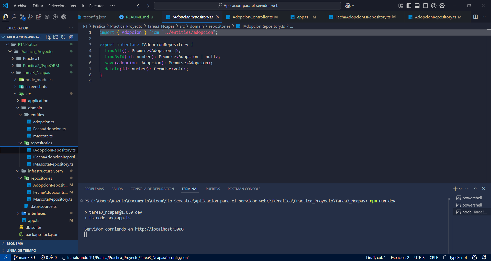
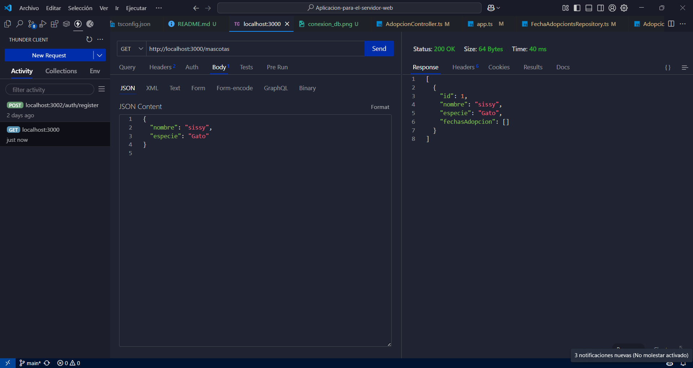
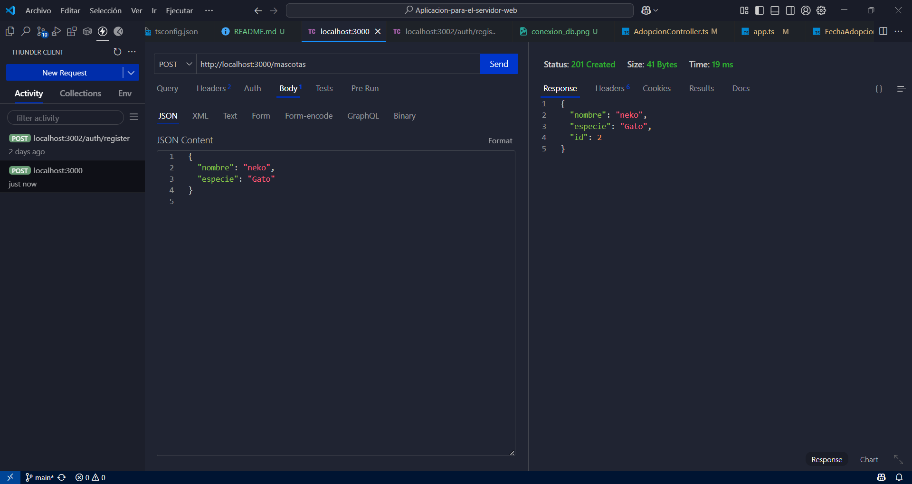
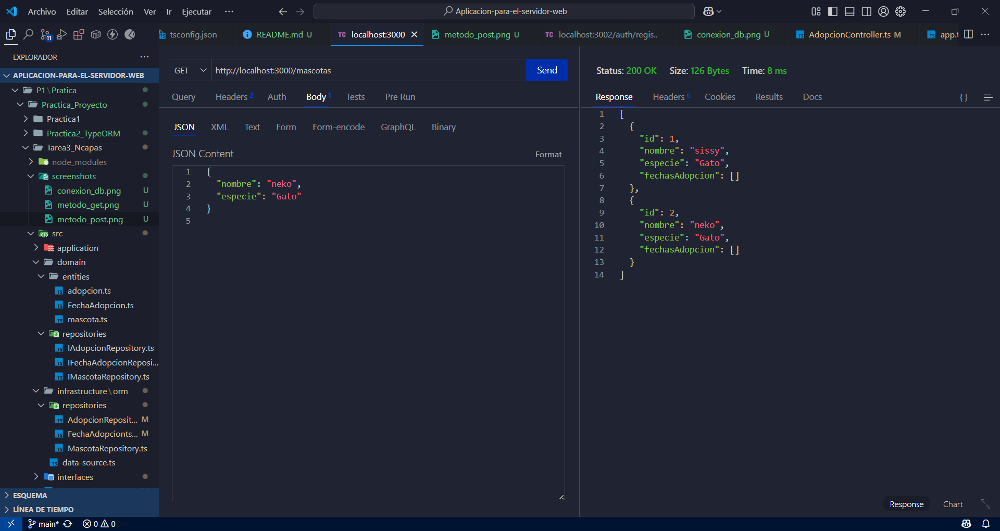

# 🐾 Práctica 3A - Arquitectura N-Capas: Adopciones con TypeORM

Este proyecto implementa un sistema de gestión de adopciones de mascotas, aplicando **arquitectura N-Capas**, completamente desacoplado de la infraestructura, permitiendo flexibilidad para intercambiar ORMs en el futuro. Actualmente, se utiliza **TypeORM** con una base de datos SQLite.

---

## 🚀 Instrucciones para ejecutar el proyecto

### ✅ Requisitos

- Node.js
- Git
- (Opcional) Docker y Docker Compose si deseas contenerizarlo en el futuro

---

### 1. Clonar el repositorio

```bash
git clone https://github.com/KristhianBello/Mini_Proyecto_login.git
cd practica3A-adopciones
```

---

### 2. Instalar dependencias

```bash
npm install
cd P1\Pratica\Practica_Proyecto\Tarea3_Ncapas
```

---

### 3. Ejecutar la aplicación

```bash
npx ts-node src/main.ts
```

O bien, si tienes un script en `package.json`:

```bash
npm run dev
```

---

## 📚 Endpoints REST

Los endpoints están organizados en base a tres entidades principales:

### 🐶 Mascotas (`/mascotas`)

- `POST /mascotas` – Crear una mascota
- `GET /mascotas` – Listar todas las mascotas
- `GET /mascotas/:id` – Obtener mascota por ID
- `DELETE /mascotas/:id` – Eliminar mascota

### 📅 Fechas de Adopción (`/fechas-adopcion`)

- `POST /fechas-adopcion` – Registrar una fecha de adopción
- `GET /fechas-adopcion` – Listar todas
- `GET /fechas-adopcion/:id` – Obtener por ID
- `DELETE /fechas-adopcion/:id` – Eliminar

### 📝 Adopciones (`/adopciones`)

- `POST /adopciones` – Registrar una adopción
- `GET /adopciones` – Listar todas
- `GET /adopciones/:id` – Obtener por ID
- `DELETE /adopciones/:id` – Eliminar

---

## ⚡ Cómo cambiar de ORM (futuro)

La arquitectura desacoplada permite usar múltiples ORMs (como Sequelize o Prisma). Solo será necesario:

1. Crear una clase `RepositorioX` con la implementación del nuevo ORM.
2. Registrar el repositorio en la capa de servicios.
3. No es necesario modificar el dominio ni los controladores.

---

## 📷 Evidencias y pruebas

- [x] Conexión exitosa a la base de datos con TypeORM
- [x] Crear entidad (POST)
- [x] Obtener todas (GET)

## 🖼 Evidencias y pruebas (screenshots)

### *TypeORM*

* *Conexión exitosa:*
  
* *Obtener todas (GET):*
  
* *Crear (POST):*
  
* *GET después del POST:*
  

---

> Las pruebas se realizaron con Thunder Client (VS Code)

---

## 📁 Estructura del proyecto

```plaintext
src/
├── domain/
│   └── entities/
├── application/
│   └── services/
├── infrastructure/
│   └── typeorm/
│       ├── data-source.ts
│       └── repositories/
├── controllers/
├── interfaces/
│   └── http/
├── main.ts
```

---

## ✨ Consideraciones

- Arquitectura limpia y escalable
- Dominios totalmente desacoplados de la infraestructura
- Pruebas exitosas de todos los endpoints
- Listo para producción con ajustes mínimos (validaciones, migraciones, auth, etc.)

---

## 👨‍💻 Autor

**Kristhian Augusto Bello Soledispa**  
_Práctica 3A - Arquitectura N-Capas con TypeORM_  
_Universidad Laica Eloy Alfaro de Manabí_
