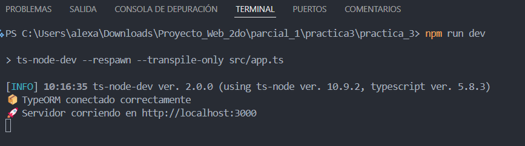
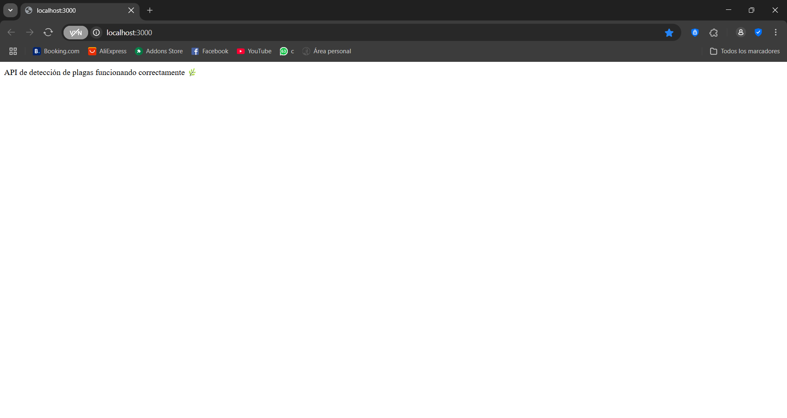

# 🌿 Sistema de Detección de Plagas

Este proyecto implementa un sistema de monitoreo y detección de plagas agrícolas 
utilizando arquitectura N-capas, conexión dual con bases de datos SQL (PostgreSQL con TypeORM) y 
NoSQL (MongoDB con Mongoose).

## 📁 Estructura del Proyecto 

/practica_3
│
├── 📁 src/
│   ├── 📁 domain/
│   │   ├── entities/
│   │   │   ├── Plaga.ts
│   │   │   ├── Captura.ts
│   │   │   ├── Notificacion.ts
│   │   │   └── ProcesamientoIA.ts
│   │   └── repositories/
│   │       ├── PlagaRepository.ts
│   │       ├── CapturaRepository.ts
│   │       ├── NotificacionRepository.ts
│   │       └── ProcesamientoIARepository.ts
│
│   ├── 📁 application/
│   │   ├── use-cases/
│   │   │   ├── crearPlaga.ts
│   │   │   ├── detectarPlaga.ts
│   │   │   ├── enviarNotificacion.ts
│   │   │   └── procesarIA.ts
│   │   └── services/
│   │       ├── PlagaService.ts
│   │       ├── CapturaService.ts
│   │       ├── NotificacionService.ts
│   │       └── ProcesamientoIAService.ts
│
│   ├── 📁 infrastructure/
│   │   ├── 📁 orm-typeorm/
│   │   │   ├── entities/
│   │   │   │   ├── PlagaEntity.ts
│   │   │   │   ├── CapturaEntity.ts
│   │   │   │   ├── NotificacionEntity.ts
│   │   │   │   └── ProcesamientoIAEntity.ts
│   │   │   └── repositories/
│   │   │       ├── TypeOrmPlagaRepository.ts
│   │   │       ├── TypeOrmCapturaRepository.ts
│   │   │       ├── TypeOrmNotificacionRepository.ts
│   │   │       └── TypeOrmProcesamientoIARepository.ts
│   │
│   │   ├── 📁 orm-mongoose/
│   │   │   ├── models/
│   │   │   │   ├── PlagaModel.ts
│   │   │   │   ├── CapturaModel.ts
│   │   │   │   ├── NotificacionModel.ts
│   │   │   │   └── ProcesamientoIAModel.ts
│   │   │   └── repositories/
│   │   │       ├── MongoosePlagaRepository.ts
│   │   │       ├── MongooseCapturaRepository.ts
│   │   │       ├── MongooseNotificacionRepository.ts
│   │   │       └── MongooseProcesamientoIARepository.ts
│
│   ├── 📁 shared/
│   │   └── 📁 database/
│   │       ├── typeorm-datasource.ts
│   │       └── mongoose-connection.ts
│
│   └── 📁 presentation/          
│       ├── controllers/
│   |    ├── routes/
│   |    └── server.ts            
│   |____app.ts
├── .env
├── package.json
├── tsconfig.json
└── README.md
 
 ## 🚀 Tecnologías Usadas

- **Node.js**
- **Express**
- **TypeScript**
- **TypeORM** (PostgreSQL)
- **Mongoose**
- **dotenv**
- **ts-node-dev**

## Arquitectura N-Capas
Capa de presentación (presentation/)

Define las rutas (Express) y controla las solicitudes.

Capa de aplicación (application/)

Contiene la lógica de negocio (servicios para manejar plagas).

Capa de dominio (domain/)

Define las interfaces, contratos y entidades base.

Capa de infraestructura (infrastructure/)

Contiene los repositorios que se conectan con:

PostgreSQL usando TypeORM

MongoDB usando Mongoose

Capa compartida (shared/)

Configura las conexiones a las bases de datos y utilidades comunes.

## Como correrlo?

Entrar a la carpeta practica_3 

